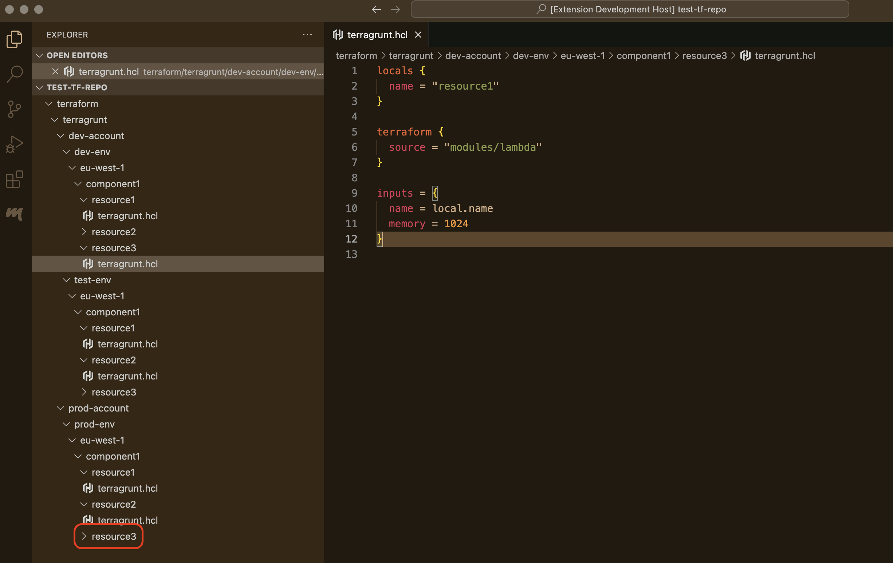

{Screenshot with menus}

# Terra parity

## Why

*Terra parity* is made to improve experience, work quality and productivity for engineers utilizing Infrastructure as Code for building software systems . 

You should be able to benefit from this extension, if the following applies to you:
- **folder per environment:** in infrastructure code as code repository each environment (`dev`, `test`, `prod` etc.) has a dedicated folder
- **dev/prod parity:** you'd like to keep your environments *as similar as possible* (see https://12factor.net/dev-prod-parity)

then infrastructure code (folder structure and resources code) would have a lot of duplication across different environments and few for-a-good-reason differences.

***Terra parity* is aiming to help engineers make changes to such code a bit more robust by providing a way to quickly navigate, compare and align code of corresponding resources.**

### Example

You provision infrastructure for a web application that has three environments - `dev`, `test` and `prod`. Your infrastructure as code has folder dedicated to each environment. For example:

#### Below are example scenario's when *Terra parity* might be helpful.

1. You work on feature which involves adding new `resource2`. After adding it on `dev` you'd typically want to navigate to `test-env/eu-west-1/component1`, create folder `resource2` and create `terragrunt.hcl` file there.In this example this isn't a big issue to do it manually - the file could easily be found in the Explorer. However for the size of any real IaC repository navigating to the right folder, creating subfolders and file would take you some time and energy. *Terra parity* automates that. Upon invocation it will render menu informing you that the  files are not found under on `test` and `prod` (`test-env/eu-west-1/component1/resource2/terragrunt.hcl` and `prod-env/eu-west-1/component1/resource2/terragrunt.hcl`). Choosing either menu will *copy* `terragrunt.hcl` to a corresponding location (with creation of missing folders) and open new file in Editor.

2. You work on feature that involves changing `app1`'s `resource1`. Again, normally you'd want to first make change on `dev` and afterwards repeat it on `test` and ensure both are aligned - either are plain copied of each other or have few for-a-good-reason differences. And again, navigating to `test` (or `prod`) could be a time consuming routine, as well as calling a comparison window to ensure the change is copied properly. *Terra parity* automates that. Upon invocation it render menu informing you that `dev-env/eu-west-1/component1/resource1/terragrunt.hcl` differs from both other envifonment's corresponding resources - `test-env/eu-west-1/component1/resource1/terragrunt.hcl` and `prod-env/eu-west-1/component1/resource1/terragrunt.hcl`. Selecting either of the menus will open files comparison window, where the `test` or `prod` could be aligned with `dev` right in place.

3. When changes don't go smooth and involve multiple rounds of small changes to resource on multiple environments, you could use *Terra parity* to do a final alignment between corresponding resources ensure that all the needed changes are present where they need to. Invoke extension from any environment's resource to see the preview of its comparison with corresponding resource and navigate between them.

4. Finally you could use it to just quickly navigate between corresponding resources for whatever other reason.

## Get started

### Configure environment paths
*Environment paths* is a set of environment folders relative paths. Open extension Settings and one by one copy relative path of your environment folder:

and add them to *Environment paths* using button "Add Item":

### Call Terra parity
1. Open one of the environment IaC file in the Editor.

2. Run command *Terra parity* from command palette (`⇧⌘P`) or use hotkey `⌃E`

3. *Terra parity* will determine the *opened file*'s environment based on configured *Environments paths* and for every other environment will try to find the *corresponding file*. *Corresponding file* is the file located under the other environment's and the same subpath as the *opened file*'s subpath from its environment. The file will be compared with opened file's content and the menu item will be rendered.

- In case the files contents are **same**, the menu will indicate it with text "Match". Upon selection the corresponding resource file will be revealed in Explorer and opened in Editor.

Result:

- In case the files contents **differ**, the menu will indicate it with text "Different". Upon selection the files comparison will be opened.

Result:

- In case the file **doesn't exist** on that environment, the menu will indicate it with text "Not found". Upon selection the opened file will be copied to corresponding environment's location.

Result:

###### Technically this tool has nothing to do with terraform, terragrunt or any other tool. It works purely with files and folders.